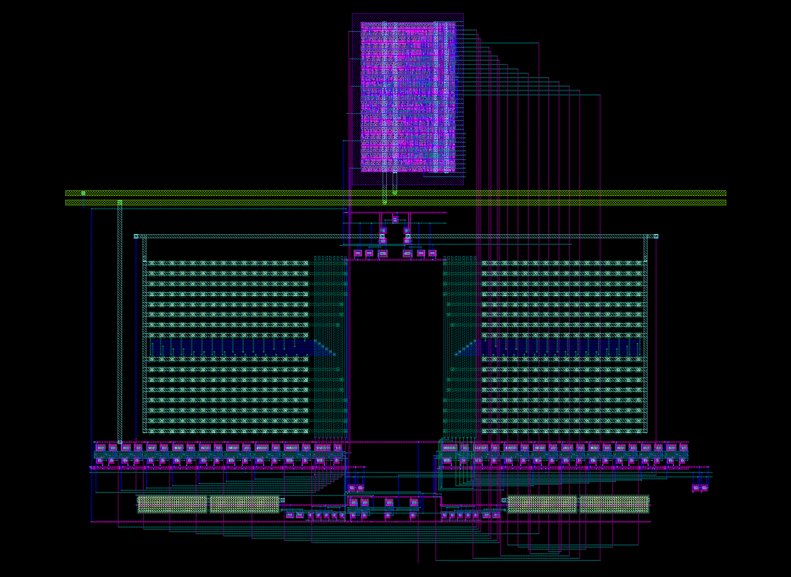
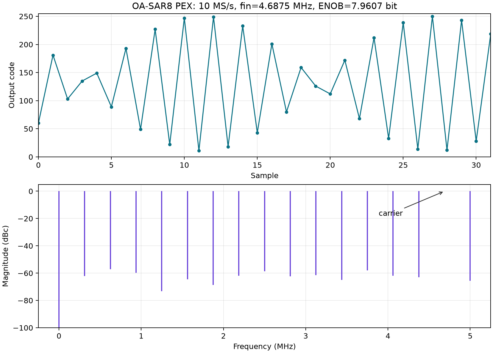

# sar-adc-8b-open — 8-bit differential SAR ADC (core18 sign-off)

这是基于 IHP SG13G2 开源 PDK 的 8 位全差分 SAR ADC。当前主线是 **core18 模拟前端 + 数字异步 SAR 控制宏 + Magic full-RC PEX**，流程可在 IIC-OSIC-TOOLS Docker 容器内无 GUI 执行。

本仓库以 `Arcadia-1/open-analog-sar-8b` 为起点，但原仓库仅作参考。定制晶体管级异步实验和大规模诊断波形不属于当前发布主线；旧 README 已改名为 `README_BASELINE_REFERENCE.md`。



## 当前签核结果

条件：IHP SG13G2、mos_tt + cap_typ、1.5 V、27 °C、Magic full-RC PEX、ngspice trap、33 次转换、32 点 FFT、TRACK=25 ns。

| 采样率 | 完成情况 | SNDR | ENOB |
|---:|---:|---:|---:|
| 10 MS/s | 33/33 | 49.683 dB | **7.9607 bit** |

10 MS/s 是当前正式签核结果；新版 10.5 MS/s 的32相位 PEX 预筛为7.7755 bit，
尚未达到7.95-bit目标，因此不把单周期可运行的12–18 MS/s冒充为动态签核结果。
当前发布版在不改 RTL 和 SAR 信号路径的前提下，将数字宏 PDN pitch 从 75.6 µm
缩至 30 µm，并把 MSB 输出附近的 VSS 回流距离从约 33 µm 缩短至约 3 µm。
这一版跨过了旧 PEX 在低频输入下的寄生收敛热点。原冻结版 7.9643-bit 结果仅作为
回归参考，新版与其相差 0.0036 bit。

物理核结果：block-level maximum DRC 0、LVS MATCH；regular DRC 的 9 项均为未加
全芯片 fill 的密度规则，非短路、间距或连通错误。

同一版 PEX 在10 MS/s、312.5 kHz 输入下也完成33/33次连续转换：SNDR 47.314 dB、
ENOB 7.567 bit、SFDR 54.311 dB。该结果高于原仓库低频7.40 bit，并证明旧版
低频 `timestep too small` 热点已经消失。



## 目录结构

```text
sar-adc/
  docs/                 当前签核规格和早期设计规格
  model/                行为模型和 ENOB/INL 分析
  rtl/                  当前数字异步 SAR 控制器 RTL
  tb/                   RTL 自检 testbench
  comparator/           StrongARM block 仿真
  sw10m/                bootstrap 采样开关仿真
  layout/               KLayout 生成脚本、CDL、core18 GDS 和 PEX
  logic/                异步宏配置及其已硬化物理视图
  postlayout/           当前 core18 PEX 测试台、FFT/功耗和静态转移分析脚本
  signoff/              新版签核指标与关键 DRC/LVS/PEX 日志
  power/                旧版/参考混合信号分析脚本
  report/               设计报告和图像
results/core18_pex/     签核和速度 A/B 的 compact metrics/sample codes
sar-chip/               旧 core16 全片集成参考流程
tools/run.sh            Docker exec 包装器
```

## 复现环境

请先阅读 `ENVIRONMENT.md` 和 `THIRD_PARTY.md`。使用：

```text
docker.io/hpretl/iic-osic-tools:2026.07
IHP SG13G2 PDK commit 84374023ee8b4b126bebbba67fcbada0a9c0ff0b
```

PDK 和 Docker 镜像是外部依赖，不随仓库分发。

当前验收边界见 [`sar-adc/docs/core18_signoff_spec.md`](sar-adc/docs/core18_signoff_spec.md)，
完整复现命令见 [`REPRODUCE_SIGNOFF.md`](REPRODUCE_SIGNOFF.md)。

## 当前 core18 PEX 复现

容器内工作目录为 `/foss/designs/sar-adc`：

```bash
python3 postlayout/run_core18_pex.py \
  --fs-msps 10 --track-ns 25 --samples 33 \
  --fft-points 32 --tone-bin 15 --amplitude 0.70 \
  --tstep-ns 0.05 --tag repro_10m
```

脚本会使用 `layout/pex_core18_final_w2_rc/oa_sar8_core18_final.pex.spice`，生成测试台、波形、样本码和 ENOB metrics。新版紧凑证据见 `sar-adc/signoff/core18_pdnfix_20260830/`，对照汇总见 `RESULTS.md`。

## 版图流程

当前 core18 版图入口：

```bash
cd /foss/designs/sar-adc/layout
(cd ../logic && librelane config_async.yaml)
# 将新的数字宏原位替换进冻结的模拟核/顶层布线：
klayout -zz -r replace_async_macro_pdnfix.py
sak-drc.sh -k -w drc_core18 oa_sar8_core18_final
sak-lvs.sh -k -w lvs_core18 -s core18_final_full.cdl \
  -l oa_sar8_core18_final.gds -c oa_sar8_core18_final
sak-pex.sh -k -w pex_core18_final_w2_rc -m 3 -t 10000 -r 1000 -y 1 oa_sar8_core18_final
```

`logic/final_async_phys/` 保存当前数字异步宏的完整物理视图；
`oa_sar8_core18_final_base_7p9643.gds` 是原位替换所需的冻结底图。重新生成后必须
重新检查 DRC、LVS、PEX，并重新运行 PEX ENOB。

## 许可证和范围

代码和版图文件按 `LICENSE` 说明发布；IHP PDK、标准单元库和 IIC-OSIC-TOOLS 受其各自许可证约束。`sar-chip/` 是早期 core16 全片集成参考，不应误认为当前 core18 签核版。
